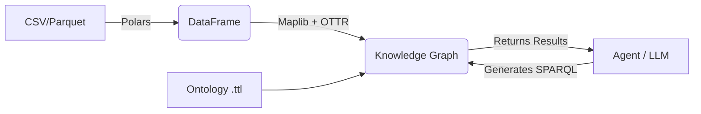

# Semantic Graph RAG with Maplib

**Build Knowledge Graphs directly from DataFrames. No vector databases required.**

This project demonstrates a **deterministic, high-precision Graph RAG** system for structured data. It targets Data Scientists and AI Engineers who want to build reliable agents over tabular data without losing the semantic structure to vector embeddings. If you find it useful, please Star ⭐ the repo so it becomes easier for oithers to find!

## 🎯 Who is this for?

- **Data Scientists**: You love Polars/Pandas but you are struggling with knowledge graphs. Here is your help
- **AI Engineers**: You have made unlimited vector RAGs on un-structured data. But you struggle with structured data.
- **Data Engineers**: You want a reproducible pipeline (ETL) from CSV to Knowledge Graph that fits into your existing Python workflows.

## 🧠 The Core Concept: "Don't Embed, Map."

Standard RAG takes structured data (like a CSV), turns it into text chunks, embeds it, and then searches for "similar" chunks. This destroys the exact relationships in your data.

**Graph RAG with Maplib** preserves the structure:

1.  **Define an Ontology (Schema)**: What are the "things" (Classes) and "relationships" (Properties)?
2.  **Create a Template (OTTR)**: How does a row in your DataFrame map to that Ontology?
3.  **Map**: Transform the DataFrame into a Graph in milliseconds.
4.  **Query**: Let the Agent write SPARQL to query the graph precisely.


**Maplib** is a high-performance Python library for mapping DataFrames to RDF Knowledge Graphs. Built on Rust and Polars, it enables extremely fast, in-memory graph construction and SPARQL querying without the overhead of a dedicated graph database server. It is designed for data scientists who want to integrate semantic technologies into their Python workflows.

-   **GitHub**: [DataTreehouse/maplib](https://github.com/DataTreehouse/maplib)
-   **PyPI**: [maplib](https://pypi.org/project/maplib/)
-   **Documentation**: [Maplib Docs](https://datatreehouse.github.io/maplib/maplib.html)

**OTTR (Reasonable Ontology Templates)** is a language for representing ontology patterns. It allows you to define reusable "macros" or templates that abstract away the complexity of RDF triples. In this project, we use OTTR to define *how* a row in a DataFrame maps to the graph structure, ensuring type safety and consistency.

-   **Learn more**: [ottr.xyz](http://ottr.xyz/)


## 🚀 Quick Start

### 1. Prerequisites

```bash
pip install -r requirements.txt
```
### 4. Configure Environment Variables

Create a `.env` file:

```env
# OpenAI Configuration
OPENAI_API_KEY=your_openai_api_key_here
OPENAI_RESPONSES_MODEL_ID=gpt-4
```


### 2. The "Hello World" of Graph Mapping

This is all the code you need to turn a CSV into a queryable Knowledge Graph.

```python
import polars as pl
from maplib import Model

# 1. Load your Data (It's just a DataFrame!)
df = pl.read_csv("data/jaguars.csv")
# ... (minimal preprocessing to create IRI strings) ...

# 2. Initialize the Graph & Load Schema
model = Model()
model.read("data/jaguar_ontology.ttl", format="turtle")

# 3. Define the Mapping (OTTR Template)
# "Map this DataFrame to the 'JaguarInstance' template"
model.add_template(open("data/jaguar_template.ottr").read())
model.map("http://example.org/ontology#JaguarInstance", df)

# 4. Query (SPARQL)
# "Find all jaguars that were killed"
results = model.query("""
    PREFIX ont: <http://example.org/ontology#>
    SELECT ?name ?cause WHERE {
        ?j a ont:Jaguar ;
           rdfs:label ?name ;
           ont:wasKilled true ;
           ont:causeOfDeath ?cause .
    }
""")
```

## 🏗 Architecture

### Why Maplib?
*   **Rust Core**: Built on Rust for performance, with Python bindings.
*   **Polars Integration**: Uses Apache Arrow for zero-copy data transfer. It's extremely fast.
*   **In-Memory**: Operates like a DataFrame—load it, map it, query it. No external database server (Neo4j/GraphDB) required for the application runtime.

### The Pipeline


## 🤖 Agent Integration (The "AI" Part)

If you want to understand more of the "graph RAG" part of this repo, check out my graph RAG template repo: (https://github.com/nemegrod/graph_RAG)

### Features

-   **Microsoft Agent Framework** for conversation management
-   **OpenAI GPT-4** powered conversational interface
-   **Function calling** for dynamic SPARQL query generation
-   **Context-aware** responses based on graph data
-   **Thread-based state management** for conversation persistence

### How it Works

Instead of "retrieving context" via vector similarity, the Agent acts as a **Semantic Query Engine**.

1.  **User Query**: "Show me rescued jaguars that were released."
2.  **LLM**: Understands the schema (`ont:isReleased`, `ont:rescuedBy`) and generates a SPARQL query.
3.  **Maplib Tool**: Executes the exact SPARQL query against the in-memory graph.
4.  **Response**: The LLM summarizes the precise results.

*See `src/agents/jaguar_tool.py` for the implementation.*


## 📂 Project Structure

```
.
├── data/
│   ├── jaguar_ontology.ttl      # The Schema (Classes/Properties)
│   ├── jaguar_template.ottr     # The Mapping Rules (CSV -> RDF)
│   └── jaguars.csv              # The Raw Data
├── src/
│   └── agents/
│       ├── jaguar_query_agent.py  # Agent definition
│       └── jaguar_tool.py         # Tool that runs SPARQL on Maplib
├── csv2graph.ipynb                # Interactive Tutorial (Start Here!)
└── main.py                        # Entry point for the Agent DevUI
```

## 🆚 Comparison: Vector RAG vs. Maplib Graph RAG

| Feature | Vector RAG (Standard) | Graph RAG (Maplib) |
| :--- | :--- | :--- |
| **Data Source** | Unstructured Text | Structured (CSV/SQL/JSON) |
| **Retrieval** | Fuzzy Similarity (Cosine) | Exact Query (SPARQL) |
| **Accuracy** | Probabilistic (Can Hallucinate) | Deterministic (100% Precision) |
| **Reasoning** | Limited by context window | Infinite (via Graph Logic) |
| **Setup** | Chunking + Embedding | Ontology + Mapping Template |

## 📚 Key Resources for Data Scientists

*   **Maplib**: [GitHub](https://github.com/DataTreehouse/maplib) - The engine powering this.
*   **OTTR**: [Website](http://ottr.xyz/) - Learn how to write templates that map tables to triples.
*   **SPARQL**: Don't be afraid! It's just SQL for Graphs. `SELECT ?s WHERE { ?s ?p ?o }`.

---
*Built for the [Microsoft Agent Framework](https://github.com/microsoft/agent-framework).*
